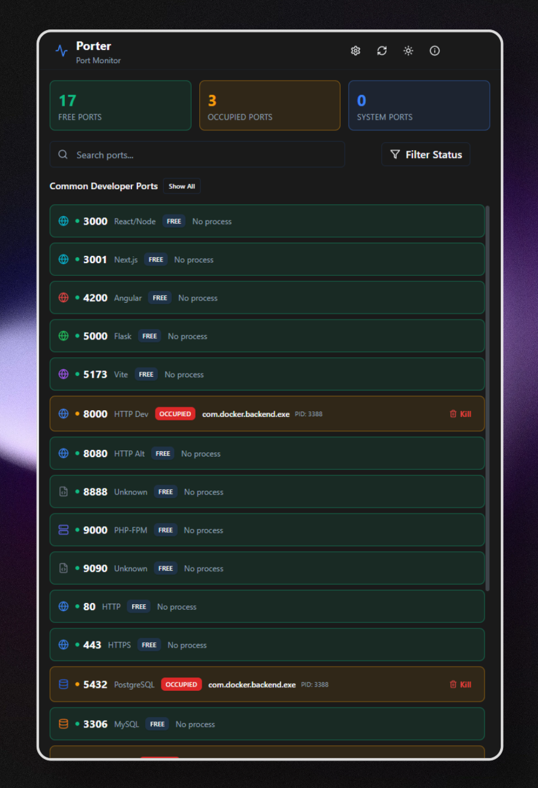

# Porter v0.1.0

A sleek, fast, and secure desktop port monitoring application built with Tauri, React, and TypeScript.

## ✨ What's New

### Core Features
- ✅ **Real-time Port Monitoring** - Monitor ports with automatic refresh
- ✅ **Customizable Port List** - Configure which ports to scan via settings
- ✅ **Show All Ports** - Toggle to view all running ports on the system
- ✅ **Process Management** - Kill processes with confirmation dialog (admin required)
- ✅ **Smart Search & Filtering** - Search by port number or process name
- ✅ **Dark/Light Mode** - Follows system preference
- ✅ **Admin Privilege Detection** - Restart as admin with one click

### UI/UX Highlights
- 🎨 Modern, compact design with custom scrollbar
- 🔍 3/4 width search bar with filter dropdown
- 🏷️ Port type icons (web, database, server indicators)
- 📊 Stats cards with improved colors (emerald/amber/blue)
- ⚡ Loading animations during port scanning
- ⚙️ Settings panel for port configuration
- ℹ️ About dialog with project info

## 📦 Downloads

### Windows
- **Installer (MSI)**: `Porter_0.1.0_x64_en-US.msi` - Recommended for most users
- **Setup (NSIS)**: `Porter_0.1.0_x64-setup.exe` - Alternative installer

### macOS
- **DMG**: `Porter_0.1.0_x64.dmg` - Drag and drop installation
- **App Bundle**: `Porter.app.tar.gz` - Manual installation

### Linux
- **AppImage**: `Porter_0.1.0_amd64.AppImage` - Universal Linux package
- **Debian**: `Porter_0.1.0_amd64.deb` - For Debian/Ubuntu based systems

## 🚀 Installation

### Windows
1. Download the MSI installer
2. Double-click to run
3. Follow the installation wizard
4. Launch Porter from Start Menu

### macOS
1. Download the DMG file
2. Open and drag Porter to Applications
3. First launch: Right-click → Open (to bypass Gatekeeper)

### Linux
1. Download the AppImage
2. Make it executable: `chmod +x Porter_0.1.0_amd64.AppImage`
3. Run: `./Porter_0.1.0_amd64.AppImage`

## 🔧 System Requirements

- **Windows**: 10/11 (64-bit)
- **macOS**: 10.15 (Catalina) or later
- **Linux**: Ubuntu 22.04+ or equivalent
- **RAM**: 100MB minimum
- **Disk**: 50MB installation size

## 📝 Release Notes

### Features
- Initial release with core port monitoring functionality
- Cross-platform support (Windows, macOS, Linux)
- Real-time port scanning with customizable refresh intervals
- Process management with admin privilege handling
- Modern UI with dark/light theme support

### Known Issues
- Process killing requires administrator/root privileges
- Some antivirus software may flag the application (false positive)

## 🐛 Bug Reports

Found a bug? Please report it on our [GitHub Issues](https://github.com/t21dev/porter-app/issues) page.

## 📜 License

Porter is open source software licensed under the MIT License.

## 🙏 Acknowledgments

Built with:
- [Tauri](https://tauri.app/) - Desktop framework
- [React](https://react.dev/) - UI framework
- [shadcn/ui](https://ui.shadcn.com/) - UI components
- [Lucide](https://lucide.dev/) - Icons

---

Made with ❤️ by the [t21.dev](https://t21.dev) team
