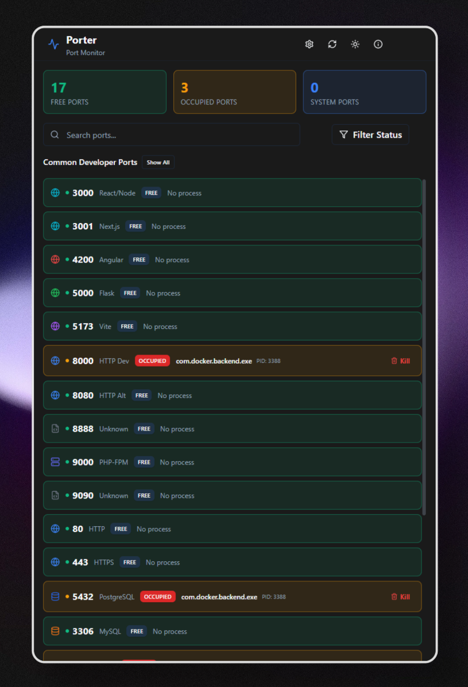

# Porter - Port Monitor

<div align="center">


[](https://github.com/t21dev/porter-app/releases)

A sleek, fast, and secure desktop port monitoring application built with Tauri, React, and TypeScript.

**[Download Latest Release](https://github.com/t21dev/porter-app/releases)** | An Opensource Project of [t21.dev](https://t21.dev)

</div>

## 🚀 Features

- **Real-time Port Monitoring** - Monitor common developer ports and all system ports in real-time
- **Customizable Port List** - Configure which ports to scan at startup via settings
- **Process Management** - Kill processes occupying ports (requires admin privileges)
- **Smart Filtering** - Filter ports by status (Free, Occupied, System) and search by port number or process name
- **Show All Ports** - Toggle between common ports and all running ports
- **Dark/Light Mode** - Beautiful dark and light themes with seamless switching
- **Admin Privilege Detection** - Automatically detects and warns when running without admin rights
- **Cross-Platform** - Works on Windows, macOS, and Linux
- **Fast & Lightweight** - Built with Tauri for minimal resource usage

## 📸 Screenshots



## 🛠️ Tech Stack

### Frontend
- **React 19** - UI framework
- **TypeScript** - Type safety
- **Tailwind CSS v3** - Styling
- **shadcn/ui** - UI components
- **TanStack Query** - Data fetching and caching
- **Zustand** - State management
- **Lucide React** - Icons

### Backend
- **Rust** - System-level operations
- **Tauri 2.0** - Desktop framework
- **sysinfo** - Process monitoring
- **Platform-specific APIs**
  - Windows: IPHLPAPI
  - Linux: /proc filesystem
  - macOS: lsof

## 📦 Installation

### Download Pre-built Release

Download the latest release for your platform from the [Releases page](https://github.com/t21dev/porter-app/releases).

| Platform | File |
|----------|------|
| Windows | `Porter_x.x.x_x64-setup.exe` or `.msi` |
| macOS | `Porter_x.x.x_aarch64.dmg` (Apple Silicon) or `Porter_x.x.x_x64.dmg` (Intel) |
| Linux | `.deb` or `.AppImage` |

#### macOS Installation Note

macOS may show an error saying **"Porter is damaged and can't be opened"**. This happens because the app is not notarized with Apple (requires a paid developer account).

**To fix this**, open Terminal and run:
```bash
xattr -cr /Applications/Porter.app
```
Then open the app normally. Alternatively, right-click the app and select "Open" instead of double-clicking.

---

### Building from Source

#### Prerequisites
- Node.js 18+
- Rust 1.70+
- npm or yarn

#### Development Setup

1. Clone the repository
```bash
git clone https://github.com/yourusername/porter-app.git
cd porter-app
```

2. Install dependencies
```bash
npm install
```

3. Run in development mode
```bash
npm run tauri:dev
```

### Building for Production

```bash
npm run tauri:build
```

The built application will be available in `src-tauri/target/release/bundle/`

## 🎮 Usage

### Running Porter

1. **Launch the application**
   - For full functionality, run as Administrator (Windows) or with sudo (Linux/macOS)

2. **View Ports**
   - Common developer ports are displayed automatically on startup
   - Green = Free, Red = Occupied, Yellow = System

3. **Search Ports**
   - Use the search bar to find specific ports by number or process name

4. **Filter by Status**
   - Click the "Filter Status" dropdown to show/hide Free, Occupied, or System ports

5. **Kill Processes**
   - Click "Kill Process" on any occupied port to terminate the process
   - Requires administrator privileges

6. **Customize Ports**
   - Click the settings icon in the header
   - Add or remove ports to scan at startup
   - Changes are saved automatically

7. **Toggle Views**
   - Click "Show All" to view all running ports on the system
   - Click "Show Common" to return to your configured port list

## 🔧 Configuration

Porter monitors the following common developer ports by default:

- **3000-3001** - React, Next.js
- **4200** - Angular
- **5000** - Flask
- **5173** - Vite
- **8000** - Django, HTTP servers
- **8080** - Alternative HTTP
- **9000** - PHP-FPM
- **80, 443** - HTTP/HTTPS
- **5432** - PostgreSQL
- **3306** - MySQL
- **6379** - Redis
- **27017** - MongoDB

You can customize the port list via the settings icon in the app header. Your custom configuration is saved in browser localStorage.

## 🏗️ Project Structure

```
porter-app/
├── src/                      # React frontend
│   ├── components/           # React components
│   │   ├── dashboard/        # Dashboard-specific components
│   │   └── ui/              # shadcn/ui components
│   ├── hooks/               # Custom React hooks
│   ├── lib/                 # Utility functions
│   ├── store/               # Zustand stores
│   ├── types/               # TypeScript types
│   └── App.tsx              # Main app component
├── src-tauri/               # Tauri backend
│   ├── src/
│   │   ├── commands/        # Tauri IPC commands
│   │   ├── models/          # Data models
│   │   ├── platform/        # Platform-specific code
│   │   └── services/        # Business logic
│   ├── Cargo.toml          # Rust dependencies
│   └── tauri.conf.json     # Tauri configuration
└── docs/                    # Documentation
```

## 🤝 Contributing

Contributions are welcome! Please follow these steps:

1. Fork the repository
2. Create a feature branch (`git checkout -b feature/amazing-feature`)
3. Commit your changes (`git commit -m 'Add amazing feature'`)
4. Push to the branch (`git push origin feature/amazing-feature`)
5. Open a Pull Request

## 📝 License

This project is licensed under the MIT License - see the [LICENSE](LICENSE) file for details.

## 🙏 Acknowledgments

- Built with [Tauri](https://tauri.app/)
- UI components from [shadcn/ui](https://ui.shadcn.com/)
- Icons from [Lucide](https://lucide.dev/)

## 📧 Support

For support, please open an issue on GitHub or contact us at support@t21.dev

---

<div align="center">

Made with ❤️ by the [t21.dev](https://t21.dev) team

</div>
