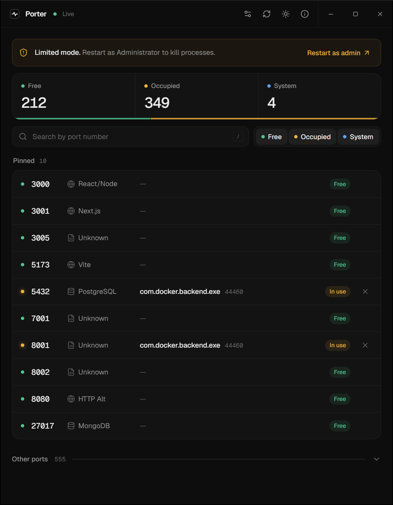
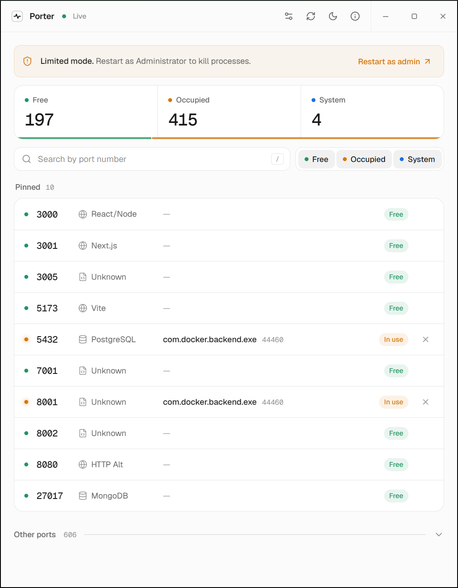

# Porter - Port Monitor

<div align="center">


[](https://github.com/t21dev/porter-app/releases)

A sleek, fast, and secure desktop port monitoring application built with Tauri, React, and TypeScript.

**[Download Latest Release](https://github.com/t21dev/porter-app/releases)** | An Opensource Project of [t21.dev](https://t21.dev)

</div>

## 🚀 Features

- **Real-time Port Monitoring** - Monitor common developer ports and all system ports in real-time
- **Customizable Port List** - Configure which ports to scan at startup via settings
- **Process Management** - Kill processes occupying ports (requires admin privileges)
- **Smart Filtering** - Filter ports by status (Free, Occupied, System) and search by port number or process name
- **Show All Ports** - Toggle between common ports and all running ports
- **Outgoing Connections** - Optionally list the local port of every open connection too, not just listening ports (Settings, off by default)
- **Dark/Light Mode** - Minimal near-black and light themes with a smooth crossfade between them
- **Custom Title Bar** - Frameless window with integrated controls (native traffic lights on macOS)
- **Admin Privilege Detection** - Automatically detects and warns when running without admin rights
- **Cross-Platform** - Works on Windows, macOS, and Linux
- **Fast & Lightweight** - Built with Tauri for minimal resource usage

## 📸 Screenshots

<p align="center">
  
  
</p>

## 🛠️ Tech Stack

### Frontend
- **React 19** - UI framework
- **TypeScript** - Type safety
- **Tailwind CSS v4** - Styling
- **shadcn/ui** - UI components
- **TanStack Query** - Data fetching and caching
- **Zustand** - State management
- **Lucide React** - Icons

### Backend
- **Rust** - System-level operations
- **Tauri 2.0** - Desktop framework
- **sysinfo** - Process monitoring
- **Platform-specific APIs**
  - Windows: IPHLPAPI
  - Linux: /proc filesystem
  - macOS: lsof

## 📦 Installation

### Download Pre-built Release

Download the latest release for your platform from the [Releases page](https://github.com/t21dev/porter-app/releases).

| Platform | File |
|----------|------|
| Windows | `Porter_x.x.x_x64-setup.exe` or `.msi`, or `Porter_x.x.x_x64_portable.zip` to run without installing |
| macOS | `Porter_x.x.x_aarch64.dmg` (Apple Silicon) or `Porter_x.x.x_x64.dmg` (Intel) |
| Linux | `.deb`, `.AppImage`, or `Porter_x.x.x_x86_64.flatpak` |

#### Flatpak (Linux)

```bash
flatpak install --user Porter_x.x.x_x86_64.flatpak
flatpak run com.triptoafsin.porter
```

The bundle fetches the GNOME runtime it needs from Flathub on first install.
A sandboxed app can't see or stop processes outside its sandbox, so the
Flatpak has permission to run commands on the host
(`--talk-name=org.freedesktop.Flatpak`): Porter uses it to run `ss`, `kill`
and `pkexec` there, and nothing else. The host needs `ss` (iproute2, present
on nearly every distribution), and `pkexec` for killing other users'
processes. The bundle doesn't update itself: Porter tells you when a new
release is out, and you install the new file the same way.

To build it yourself from a `.deb` made by `npm run tauri build`:

```bash
flatpak/build.sh src-tauri/target/release/bundle/deb/Porter_x.x.x_amd64.deb Porter.flatpak
```

#### Portable version (Windows)

Unzip `Porter_x.x.x_x64_portable.zip` anywhere, a USB stick included, and run
`Porter.exe`. Nothing is installed. The `portable` file next to it keeps your
settings and pinned ports in a `data` folder beside the exe, so deleting the
folder removes every trace. Delete the `portable` file to use the normal
per-user data folder instead. It needs the Microsoft Edge WebView2 Runtime,
which Windows 10 and 11 already have.

#### Windows SmartScreen

The builds are not code-signed yet, so on first run SmartScreen may show
"Windows protected your PC": click More info, then Run anyway. Each release
lists the SHA-256 checksum of every download in `SHA256SUMS.txt`, so you can
check what you installed.

#### macOS Installation Note

macOS may show an error saying **"Porter is damaged and can't be opened"**. This happens because the app is not notarized with Apple (requires a paid developer account).

**To fix this**, open Terminal and run:
```bash
xattr -cr /Applications/Porter.app
```
Then open the app normally. Alternatively, right-click the app and select "Open" instead of double-clicking.

---

### Run in Docker

Porter also runs in a container, shown in your browser. It shares the host's
process namespace and reads the host's socket table, so it lists the listening
ports of the machine the container runs on. That makes it useful on a headless
Linux server, or for seeing which of your containers holds which port.

```bash
docker compose up -d --build
```

Then open <http://localhost:6080>. The view has no password, so the port is
published on `127.0.0.1` only; to reach it from another machine, use an SSH
tunnel (`ssh -L 6080:localhost:6080 your-server`).

- On a Linux host, Porter sees every listening port on the host and the process
  behind it, and can stop it.
- On Docker Desktop (Windows, macOS), the host is Docker's Linux VM, so Porter
  shows your containers' published ports (owned by `dockerd`) rather than the
  ports of Windows or macOS itself.
- Settings and pinned ports are kept in the `porter-data` volume.

---

### Building from Source

#### Prerequisites
- Node.js 18+
- Rust 1.70+
- npm or yarn

#### Development Setup

1. Clone the repository
```bash
git clone https://github.com/yourusername/porter-app.git
cd porter-app
```

2. Install dependencies
```bash
npm install
```

3. Run in development mode
```bash
npm run tauri:dev
```

### Building for Production

```bash
npm run tauri:build
```

The built application will be available in `src-tauri/target/release/bundle/`

## 🎮 Usage

### Running Porter

1. **Launch the application**
   - For full functionality, run as Administrator (Windows) or with sudo (Linux/macOS)

2. **View Ports**
   - Common developer ports are displayed automatically on startup
   - Green = Free, Amber = In use, Blue = System

3. **Search Ports**
   - Use the search bar to find a port by number or by the name of the process holding it (press `/` to focus it, `Esc` to clear)

4. **Filter by Status**
   - Toggle the Free, Occupied, and System chips next to the search bar

5. **Kill Processes**
   - Click the ✕ on any in-use port and confirm to terminate the process
   - Requires administrator privileges

6. **Pin Ports**
   - Hover any row and click the pin to keep that port at the top, running or not; click it again on a pinned row to unpin (with Undo)
   - Or use the settings icon in the title bar to type port numbers in
   - Up to 50 pinned ports, saved automatically

7. **Toggle Views**
   - Expand "Other ports" below your pinned list to see every listening port on the system
   - Turn on **Only show pinned ports** in settings to hide Other ports entirely for a shorter, cleaner view
   - Turn on **Show outgoing connections** in settings to also list the local port of every open connection

## 🔧 Configuration

Porter monitors the following common developer ports by default:

- **3000-3001** - React, Next.js
- **4200** - Angular
- **5000** - Flask
- **5173** - Vite
- **8000** - Django, HTTP servers
- **8080** - Alternative HTTP
- **9000** - PHP-FPM
- **80, 443** - HTTP/HTTPS
- **5432** - PostgreSQL
- **3306** - MySQL
- **6379** - Redis
- **27017** - MongoDB

You can customize the port list via the settings icon in the app header. Your custom configuration is saved in browser localStorage.

## 🏗️ Project Structure

```
porter-app/
├── src/                      # React frontend
│   ├── components/           # React components
│   │   ├── dashboard/        # Dashboard-specific components
│   │   └── ui/              # shadcn/ui components
│   ├── hooks/               # Custom React hooks
│   ├── lib/                 # Utility functions
│   ├── store/               # Zustand stores
│   ├── types/               # TypeScript types
│   └── App.tsx              # Main app component
├── src-tauri/               # Tauri backend
│   ├── src/
│   │   ├── commands/        # Tauri IPC commands
│   │   ├── models/          # Data models
│   │   ├── platform/        # Platform-specific code
│   │   └── services/        # Business logic
│   ├── Cargo.toml          # Rust dependencies
│   └── tauri.conf.json     # Tauri configuration
└── docs/                    # Documentation
```

## 🤝 Contributing

Contributions are welcome! Please follow these steps:

1. Fork the repository
2. Create a feature branch (`git checkout -b feature/amazing-feature`)
3. Commit your changes (`git commit -m 'Add amazing feature'`)
4. Push to the branch (`git push origin feature/amazing-feature`)
5. Open a Pull Request

## 🔒 Privacy

Porter reads your computer's port table locally and has no account, no
analytics and no telemetry. It connects to one other system: GitHub, to check
for a new release. The full policy is in [PRIVACY.md](PRIVACY.md).

## 📝 License

This project is licensed under the MIT License - see the [LICENSE](LICENSE) file for details.

## 🙏 Acknowledgments

- Built with [Tauri](https://tauri.app/)
- UI components from [shadcn/ui](https://ui.shadcn.com/)
- Icons from [Lucide](https://lucide.dev/)

## 📧 Support

For support, please open an issue on GitHub or contact us at support@t21.dev

---

<div align="center">

Made with ❤️ by the [t21.dev](https://t21.dev) team

</div>
